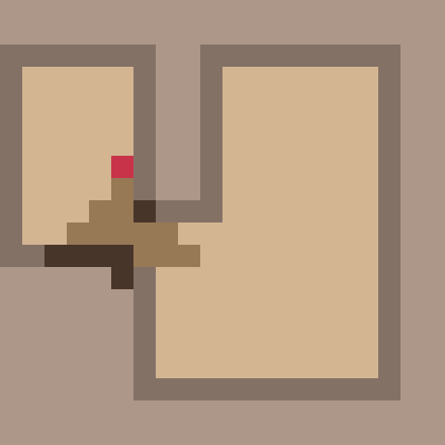

# Домашнее задание 5

## Запуск

Установка зависимостей:
```
pip install -r requirements.txt
```

Копирование модуля для запуска среды
```
git submodule update --init --remote
```

Запуск
```
python ppo_example.py
```

## Отчет

### Выбор функции награды

Я использовал следующую функцию награды. Штрафовал агента на -1, если он стоит на месте (так как агент работает в статичной среде, стоять на месте не осмыслено). Если же агент совершал движение, то он либо получает штраф -0.5, если переходит в уже посещенную клетку (это, по сути, штраф за потраченное время), либо получает награду пропорциональную числу исследованных клеток (чтобы мотивировать агента лучше искать клетки в конце).

```
if info["moved"]:
    if info["new_explored"] > 0:
        reward = 0.1 + info["total_explored"] / info["total_cells"] * 20
    else:
        reward = -0.5
else:
    reward = -1.
```

Эксперименты показали, что с такой функцией награды агент добивается лучших результатов.

<p align="center">

</p>

### Логгирование

Я логгировал эксперименты в [WandB](https://wandb.ai/gbarto/history_hw5?workspace=user-gbarto). Там можно найти:
* Гиперпараметры запусков
* Графики лоссов и метрик во время обучения
* Визуализации траекторий

### Приедложения для дальнейших экспериментов

Посмотрим на траекторию

<p align="center">

</p>

1. Как видно, агент все еще периодически застревает на месте. Во-первых, можно попробовать сильнее штрафовать агента за простой. Во-вторых, можно увеличивать штраф тем больше, чем дольше агент стоит на месте.
2. Возможно имеет смысл использовать агента с памятью. Это может помочь агенту быть более последовательным (а также это может помочь в не статичных окружениях).
3. Можно экспериментировать с другими RL алгоритмами (не только PPO).
4. Можно использовать демонстрации, по которым агенту может быть легче найти оптимальную политику.
