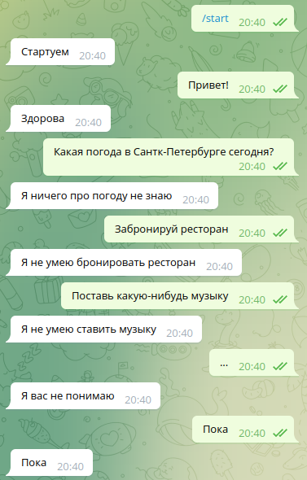
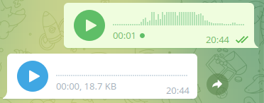
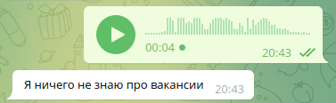

# Домашнее задание 7 [Telegram bot](t.me/history_prod_bot)

<p align="center">

</p>

## Запуск

Требования
* Python 3.7+

Установка зависимостей:
```
pip install -r requirements.txt
```

Перед запуском в папке ```data``` создайте файл ```token.json``` и положите в него токен своего бота вот в таком формате
```
{
	"token": "TOKEN"
}
```

Запуск
```
python main.py
```

По умолчанию бот будет отвечать голосовыми сообщениями.

<p align="center">

</p>

Чтобы он отвечал текстовм, нужно сделать так
```
python main.py --text
```

<p align="center">

</p>

## Описание

Бот умеет отвечать на текстовые и голосовые сообщения. В зависимости от настроек при запуске сам бот также может отвечать текстом или голосовыми сообщениями.

Для распознавания речи использовалась вот эта [модель](https://github.com/jonatasgrosman/asrecognition)

Так как я не нашел предобученной модели, которая классифицировала бы запросы на русском языке, я предварительно перевожу текст на английский с помощью вот этой [модели](https://huggingface.co/facebook/m2m100_418M).

Классификацию я делал с помощью вот этой модели от [deeppavlov](http://docs.deeppavlov.ai/en/master/features/models/classifiers.html) обученной на датасете [DSTC 2](http://camdial.org/~mh521/dstc/).

Таким образом модель распознает следующие интенты:
* GetWeather
* BookRestaurant
* PlayMusic
* AddToPlaylist
* RateBook
* SearchScreeningEvent
* SearchCreativeWork

На все запросы бот отвечает заготовленными фразами.

Дополнительно бот может поздороваться, попращаться и сказать, что он вас не понимает. Все это он делает сравниваясь с корпусом текстов [отсюда](https://github.com/Koziev/chatbot).
